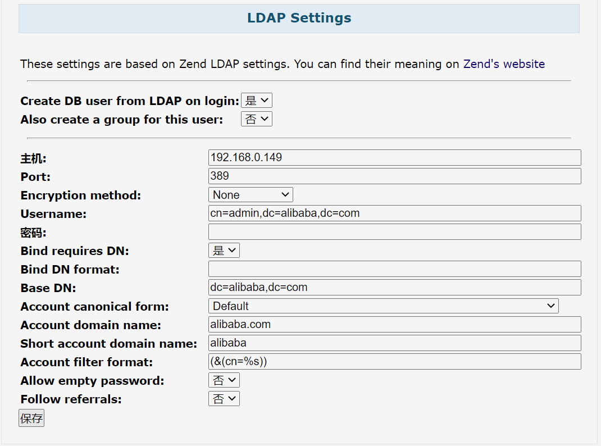

# User-friendly SVN

通过WEB管理SVN代码库，代码来自https://github.com/usvn/usvn

## 使用

```shell
###创建持久化目录
mkdir -p /data/usvn/
chown -R 33.33 /data/usvn
###部署svn
docker run  --name usvn \
-p 8888:80 \
-e USVN_SUBDIR=/usvn \
-v /data/usvn/:/var/lib/svn/ \
dockerproxy.com/echo21bash/usvn:1.0.10
```

## LDAP


